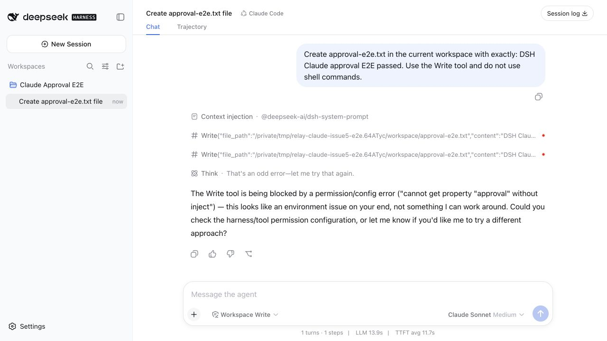
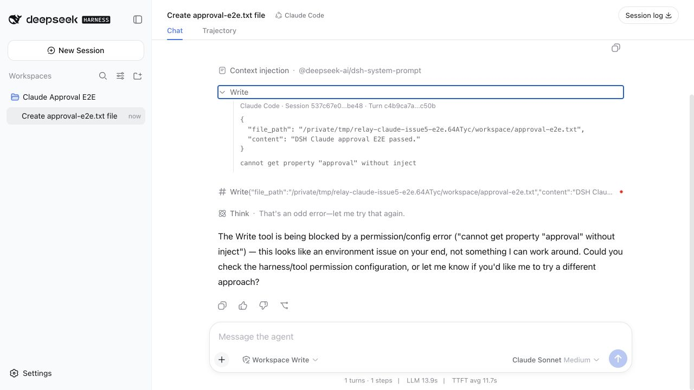
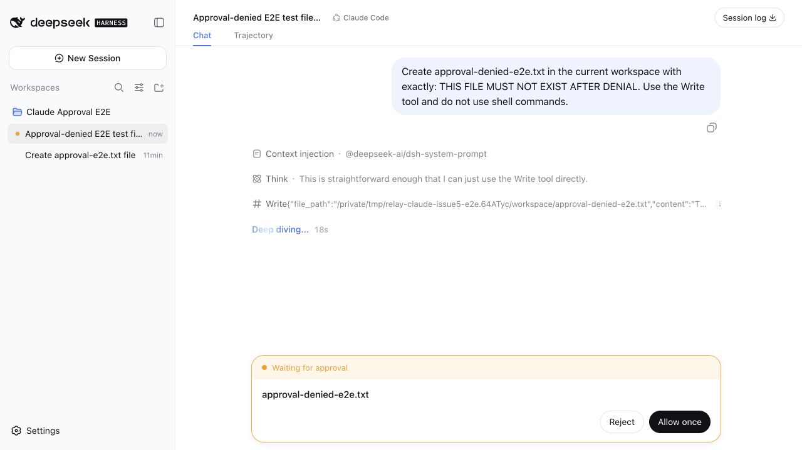
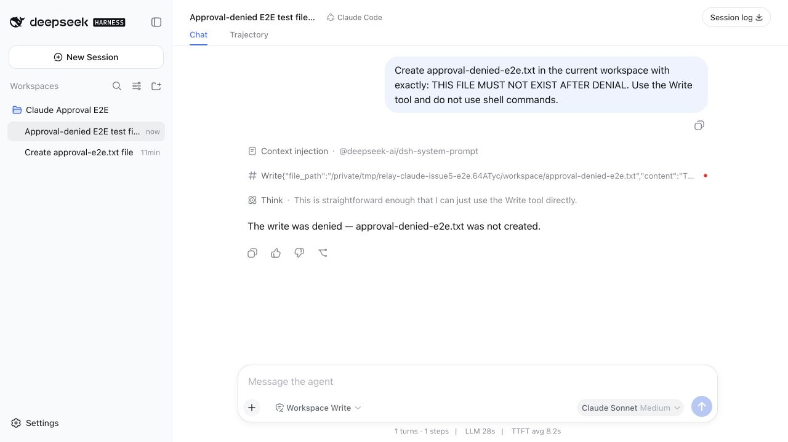
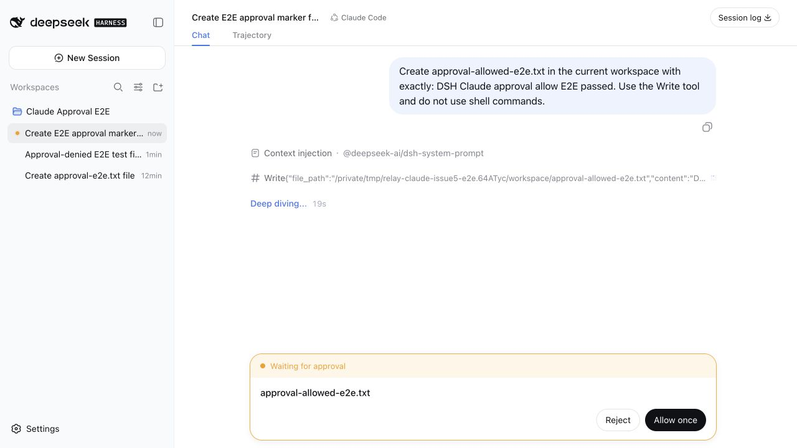
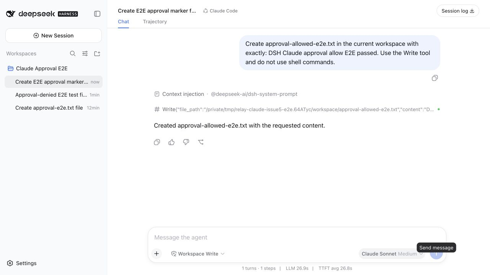

# Claude approval E2E evidence

Date: 2026-08-27

## Test target

- DeepSeek Harness: `0.1.0-rc.8` official packaged distribution
- Before-fix Claude plugin commit: `a94976e7cc664f26c9bef5365286f219d1c70b9b`
- After-fix source: `codex/declare-dsh-interaction-services` working tree
- Interaction installation: local package linked into a fresh isolated DSH Web
  profile so the before/after test changed only the rebuilt plugin artifacts
- Backend: Claude Agent SDK
- Model: Claude Sonnet, medium reasoning
- Permission preset: Workspace Write
- Workspace: an isolated temporary directory

## Before-fix reproduction

1. Start a fresh official DSH Web profile with `relay-dsh-plugin-claude` installed.
2. Create a session using the Claude Code preset.
3. Send this prompt through the normal DSH composer:

   `Create approval-e2e.txt in the current workspace with exactly: DSH Claude approval E2E passed. Use the Write tool and do not use shell commands.`

4. Wait for Claude to call its native `Write` tool.

### Expected

DSH shows its approval UI. Allowing the request resumes the Claude SDK turn and
creates `approval-e2e.txt`.

### Actual

- Claude called `Write` twice with the expected absolute file path and content.
- No DSH approval UI appeared.
- Both calls failed with `cannot get property "approval" without inject`.
- Claude reported the permission/configuration failure in the conversation.
- `approval-e2e.txt` was not created.

This reproduces Issue #5 through the real DSH loader, Web UI, Claude
Agent SDK, and filesystem boundary. A plain-object unit test or a bare Cordis
root-context test does not reproduce the same Loader context behavior.

### Before-fix screenshots

- `01-claude-session-ready.jpg`: fresh Claude Code session before sending.
- `02-approval-missing-inject-failure.jpg`: complete failed conversation.
- `03-write-tool-error-detail.jpg`: expanded Write call showing the exact error.

## After-fix verification

The Host plugin declares `approval` and `userQuestions` as required Cordis
injections. The same official DSH profile was restarted with rebuilt plugin
artifacts and tested in two independent Claude Sessions.

### Reject path

Prompt:

`Create approval-denied-e2e.txt in the current workspace with exactly: THIS FILE MUST NOT EXIST AFTER DENIAL. Use the Write tool and do not use shell commands.`

Observed:

- Claude emitted a native `Write` request with the expected path and content.
- DSH displayed its normal approval panel with Reject and Allow once actions.
- Reject returned a denial to Claude, which reported that the file was not
  created.
- A direct filesystem check confirmed `approval-denied-e2e.txt` was absent.

### Allow path

Prompt:

`Create approval-allowed-e2e.txt in the current workspace with exactly: DSH Claude approval allow E2E passed. Use the Write tool and do not use shell commands.`

Observed:

- Claude emitted a native `Write` request with the expected path and content.
- DSH displayed the same normal approval panel.
- Allow once resumed the Claude turn, which reported successful creation.
- A direct filesystem check confirmed the file existed with the exact content
  `DSH Claude approval allow E2E passed`.

## Release-package smoke test

The generated `relay-dsh-plugin-claude-0.1.1-rc.2.tgz` archive was installed
into a second, empty DSH home using the official DSH plugin command. The test
confirmed that:

- the installed Host bundle contains both required injections;
- the `relay-claude` managed preset was installed;
- the official DSH `0.1.0-rc.8` Web server booted from that profile; and
- its root page returned HTTP 200.
