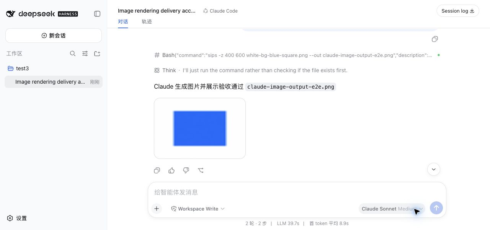
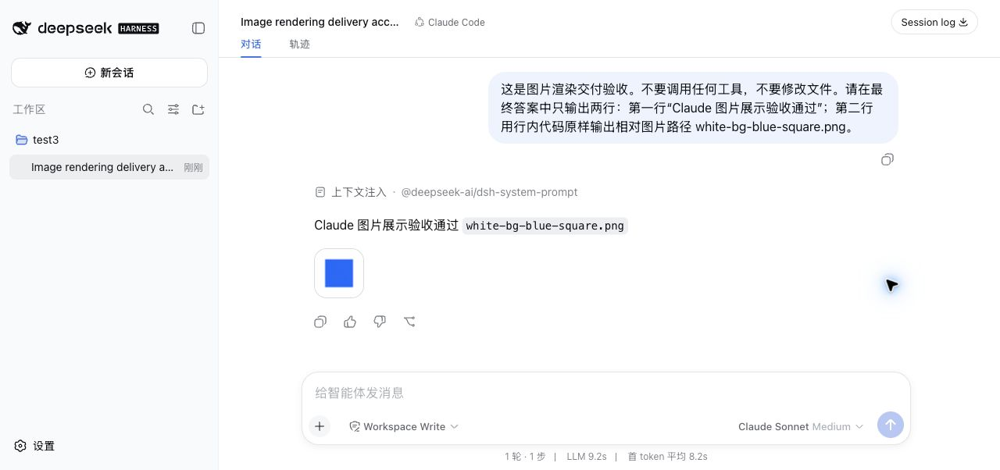

# Claude image output delivery evidence

Issue: [#17 Promote final-answer image paths into durable DSH assistant images](https://github.com/yangbobo2021/relay-dsh-plugin-claude/issues/17)

Implementation base: `80c2192070917f3cf7b0fd0a2513115ffc2b0657`

DSH reference: `b150a551b8d465e31e418e1b2eaf5e79bbb7d28e`

## Automated evidence

Run from the plugin repository on 2026-08-28:

```bash
npm run verify
```

Result:

- TypeScript passed.
- All 72 plugin tests passed with 0 failures, skips, or todos.
- Host and client production bundles built successfully.
- `git diff --check` passed.

The focused image-output lane passed 46 tests before the full suite:

```bash
node --test test/image-output.test.mjs test/dsh-adapter.test.mjs test/sdk-client.test.mjs
```

## Acceptance evidence map

| Delivery behavior | Automated evidence |
| --- | --- |
| Final local path becomes an assistant image | `a final-answer path becomes a durable standard DSH assistant image block` |
| DSH protocol compatibility | The test feeds emitted chunks through the real `@deepseek-ai/dsh-llm` `BlockAssembler` and asserts `reasoning`, `text`, `image` blocks in order |
| Final version is selected once | The adapter fixture writes versions one, two, and three before turn completion; version three is persisted |
| Historical image is immutable | The source is overwritten with version four after completion while the stored attachment remains version three |
| Multiple syntax forms, order, spaces, case, and deduplication | `final-answer image path syntax preserves mention order and removes duplicates` |
| Missing, unsupported, directory, corrupt, and validation failures | `missing paths fail explicitly...` and `unsupported types, directories, and attachment validation failures stay as diagnostics` |
| Workspace confinement and symlink escape | `workspace containment rejects absolute and symlink escapes without reading them` |
| Count and aggregate byte limits | `output image count and aggregate bytes obey DSH message limits` |
| Existing DSH tool image result | `DSH tool image attachments remain structured and render as fallback` |
| Claude SDK Base64 image result | `Claude SDK Base64 tool-result images are persisted as fallback` and `Claude SDK preserves structured tool-result images without leaking Base64 into activity` |
| Final text wins over old text and unrelated candidates | `only the last visible Claude text block selects final-answer paths` and `a final-answer path takes precedence over unrelated structured image candidates` |
| Failed turn does not insert an image | `failed Claude turns never promote image paths` |
| Existing flows remain intact | Full suite covers CLI fail-closed behavior, image input, text streaming, tool activity, approvals, questions, session continuation, auxiliary title sessions, packaging, and release metadata |

## Real DSH Web visual evidence

The merged plugin was packed as `relay-dsh-plugin-claude@0.1.1-rc.4`, installed
into an isolated `DSH_HOME`, and loaded by official DSH Web `0.1.1-rc.2`.
A real Claude Code session then completed these two acceptance turns:

1. Claude returned a final answer containing the relative path
   `white-bg-blue-square.png`; DSH rendered the existing 64 x 64 PNG beneath
   the final answer.
2. Claude invoked Bash to create `claude-image-output-e2e.png` at 600 x 400,
   returned that relative path in its final answer, and DSH rendered the new
   PNG in the same assistant message.

The second turn provides the strongest end-to-end evidence because the image
did not exist until Claude's approved tool call completed. The captured DOM
contained both the final-answer code span and an image element named
`claude-image-output-e2e.png`.



The first, no-tool path-promotion turn is preserved separately:



## Evidence boundary

The plugin owns conversion through the emitted standard DSH block:

```js
{ type: "image", attachment: imageAttachmentRef }
```

The real DSH assembler acceptance above proves that the adapter output persists
as an assistant image content block. The real DSH Web screenshots additionally
prove that DSH's existing conversation and attachment plugins load and visually
render that standard block; this change does not fork or modify their UI path.
