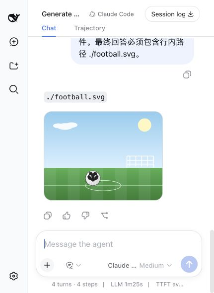

# Claude SVG Output Acceptance Evidence

## Environment

- Plugin branch: `codex/rasterize-svg-output-20`
- Local package version: `0.1.1-rc.4`
- DSH package: `0.1.1-rc.2`
- Official DSH reference commit: `b150a551b8d465e31e418e1b2eaf5e79bbb7d28e`
- Session workspace fixture: an existing, self-contained `football.svg` with declared dimensions `800 x 600`

## Real DSH Web acceptance

1. Built and packed the plugin, then installed the tarball into a clean, isolated DSH profile with its production dependencies.
2. Continued the real Claude Code Session that originally produced the SVG.
3. Asked Claude not to modify files and to reference `./football.svg` in its final answer.
4. DSH emitted a standard assistant image block named `football.png`; the previous `the image type is unsupported` diagnostic did not appear on the new message.
5. Reloaded the DSH page and verified the rendered DOM image again. It reported `complete: true`, `naturalWidth: 800`, and `naturalHeight: 600`.
6. Inspected the persisted DSH attachment object. `file` identified a non-interlaced, 8-bit RGBA PNG at `800 x 600`; its SHA-256 was `44ffd9732db04dd59b7533b1396878d63c5ef05e7c0d30312924c6215b9c25ed`, matching its content-addressed attachment id.
7. Verified that the source SVG was unchanged and no sibling `football.png` existed in the Session workspace.

## Automated evidence

- Focused image-output and adapter suite: 43 passed, 0 failed.
- Full plugin suite: 79 passed, 0 failed.
- TypeScript typecheck: passed.
- Host and client production builds: passed.
- Package dry run: 15 expected files; `sharp` remains a declared runtime dependency and is external to the host bundle.
- Production dependency audit: 0 vulnerabilities.

The focused suite covers SVG/raster ordering and deduplication, immutable one-time conversion, no workspace PNG side effect, standard DSH `BlockAssembler` output, source and converted byte limits, pixel and per-side limits, malformed input, deterministic timeout diagnostics, failed-turn suppression, HTTP resource refusal, script/event non-execution, and external-entity rejection.
